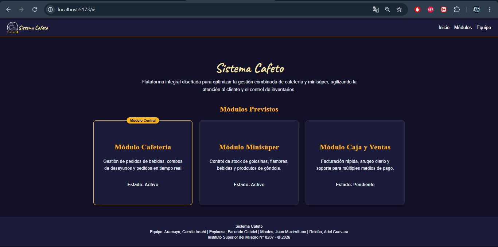

# Sistema Cafeto 
## Descripción 
Sistema Cafeto es una plataforma integral diseñada para optimizar la gestión combinada de cafetería y minisúper, agilizando la atención al cliente y el control de inventarios. 

## Integrantes
- Aramayo, Camila Anahí
- Espinosa, Facundo Gabriel 
- Montes, Juan Maximiliano 
- Roldán, Ariel Guevara

## Comandos para ejecutar el proyecto 
1\. Clonar el repositorio: git clone https://github.com/Juan-Maximiliano-Montes/Sistema-Cafeto.git 
2\. Ingresar a la carpeta del proyecto: cd Sistema-Cafeto 
3\. Instalar dependencias: npm install 
4\. Iniciar el servidor de desarrollo: npm run dev